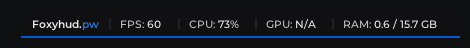
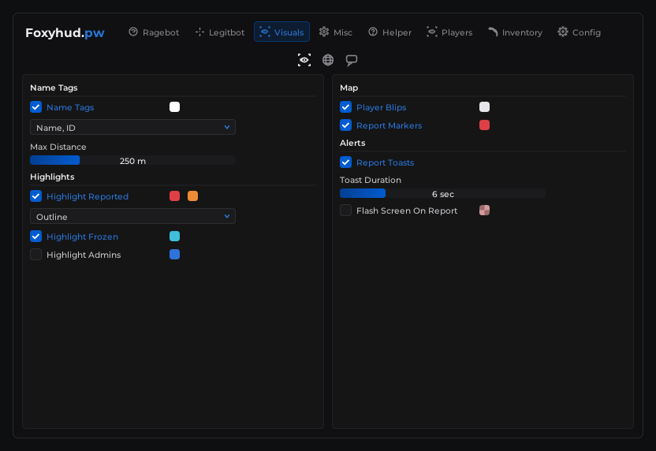
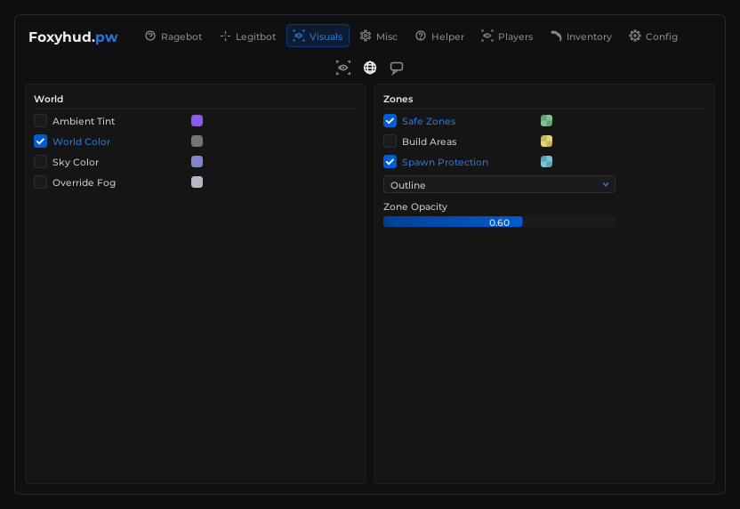
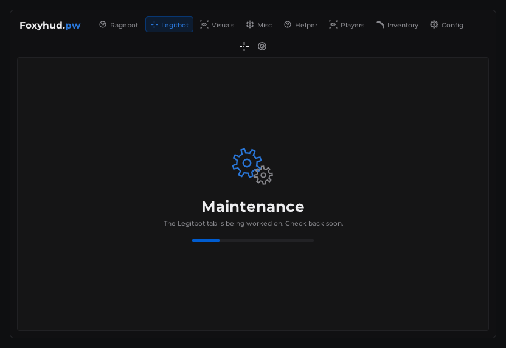
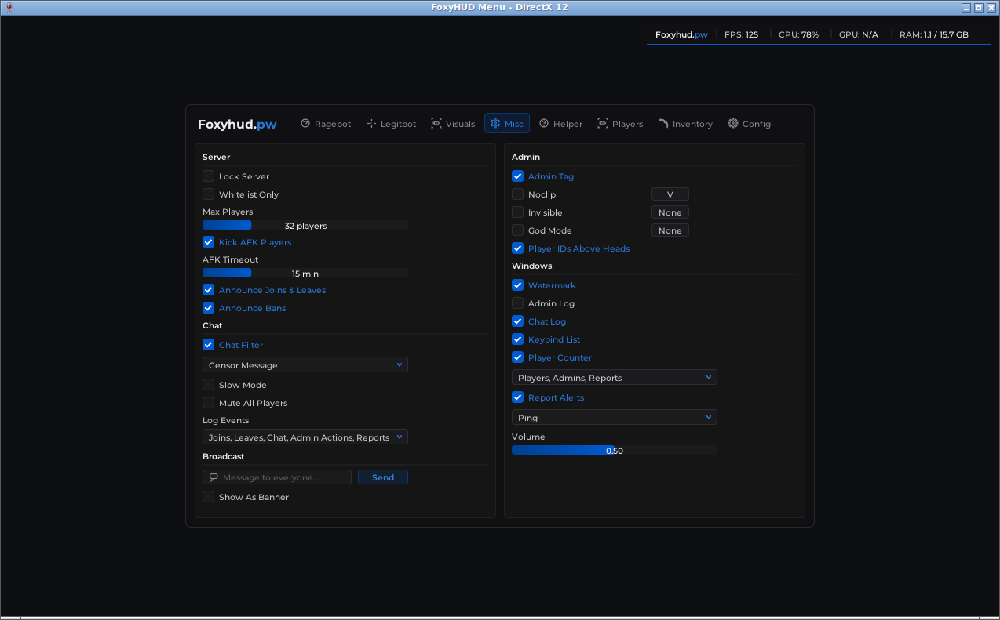

# Foxyhud.pw Menu

A custom [Dear ImGui](https://github.com/ocornut/imgui) menu with a dark theme: brand name and icon tabs in the
header, icon sub-tabs, bordered two-column boxes, blue checkboxes, color swatches, gradient sliders, dropdowns and
keybind boxes, plus a watermark bar with live FPS / CPU / GPU / RAM. It builds for **DirectX 9, 10, 11 and 12**
(plus OpenGL for Linux/macOS).

The menu is **design only**. Every control remembers its value, and the Config tab can save and load those values,
but nothing is connected to a game yet. What works:

- the menu key (Insert) opens and closes the menu;
- each keybind box captures a key, and that key toggles the checkbox next to it;
- configs can be created, loaded, saved, deleted, and the folder opened;
- the Config tab's accent color, animations, tooltips and opacity change the menu itself;
- the [watermark](#watermark) (Misc > Windows > **Watermark**) shows live FPS, CPU, GPU and RAM usage.




| Visuals: Players | Visuals: World | Players |
| --- | --- | --- |
|  |  |  |

| Legitbot (Maintenance + sub-tabs) | Config | Running on DirectX 12 |
| --- | --- | --- |
|  |  |  |

## Tabs

`Ragebot | Legitbot | Visuals | Misc | Helper | Players | Inventory | Config`

| Tab | Sub-tabs (icons under the header) | Content |
| --- | --- | --- |
| Ragebot | none | Maintenance placeholder |
| Legitbot | General, Advanced | Maintenance placeholder |
| **Visuals** | Players, World, Chat | Checkboxes with color swatches, dropdowns and sliders |
| **Misc** | none | Server, Chat, Broadcast, Admin (with keybinds) and Windows (incl. the Watermark checkbox) sections |
| Helper | none | Maintenance placeholder |
| **Players** | none | Search, filters, action checkboxes, buttons, moderation controls, quick keybinds |
| Inventory | none | Maintenance placeholder (karambit icon) |
| **Config** | none | Config list + Create, Load / Save / Delete / Refresh / Open Folder, menu settings, build date |

**Color swatches:** left-click opens the picker (color square, hue and alpha bars, presets and a hex field).
Right-click gives Copy / Paste.

## Watermark

A bar in the top-right corner of the screen:

`Foxyhud.pw | FPS: 144 | CPU: 12% | GPU: 34% | RAM: 8.1 / 15.9 GB`

- It uses the menu's background color, with an accent-color line along the bottom. "Foxyhud." is white and "pw" is
  the accent color, the same as the brand in the menu header.
- It stays on screen while the menu is closed. Turn it on or off with Misc > Windows > **Watermark** (saved in
  configs). What it shows can't be changed.
- The numbers are live, like Task Manager. FPS updates twice a second. CPU, GPU and RAM are read once a second on a
  background thread, which only runs while the watermark is on, so the game's frames never wait on them.

Where the numbers come from:

| | Windows | Linux |
| --- | --- | --- |
| FPS | the game's frame rate (ImGui) | same |
| CPU | Task Manager's counter (`% Processor Utility`) | `/proc/stat` |
| GPU | Task Manager's counter (`GPU Engine`, busiest engine; Windows 10 1709+) | AMD and some Intel GPUs (`gpu_busy_percent`) |
| RAM | used / total physical memory | `MemTotal - MemAvailable` / `MemTotal` |

A value shows **N/A** when the system doesn't expose it (for example GPU on NVIDIA under Linux, or in a VM).

## Build on Windows (DirectX 9 / 10 / 11 / 12)

You need:
- **Visual Studio 2022** with the "Desktop development with C++" workload;
- **CMake 3.16+**;
- **Git**.

Dear ImGui is downloaded during the first build.

```powershell
git clone -b claude/festive-curie-eqrl9v https://github.com/meisterjager2008-wq/foxyhud-admin-panel.git
cd foxyhud-admin-panel
cmake -S . -B build
cmake --build build --config Release
```

This builds one demo per DirectX version:

```powershell
.\build\Release\foxyhud_demo_dx9.exe
.\build\Release\foxyhud_demo_dx10.exe
.\build\Release\foxyhud_demo_dx11.exe
.\build\Release\foxyhud_demo_dx12.exe
```

Each demo opens a window with only the menu in it. Press **Insert** to toggle it.

To build only some versions, turn the others off, e.g. `cmake -S . -B build -DFOXYHUD_DX9=OFF -DFOXYHUD_DX10=OFF`.

## Build on Linux / macOS (OpenGL)

```bash
cmake -S . -B build
cmake --build build
./build/foxyhud_demo_opengl
```

On Linux you also need `libgl-dev libxrandr-dev libxinerama-dev libxcursor-dev libxi-dev`.

## Put it in your game

### 1. Add it to your build

```cmake
set(FOXYHUD_DX11 ON)          # the DirectX version(s) your game uses: FOXYHUD_DX9 / DX10 / DX11 / DX12
add_subdirectory(foxyhud-admin-panel)
target_link_libraries(MyGame PRIVATE foxyhud_dx11)   # foxyhud_dx9 / foxyhud_dx10 / foxyhud_dx11 / foxyhud_dx12
```

Your game can support several versions: turn on each option and link each `foxyhud_dxN` library.

If your game already builds Dear ImGui as an `imgui` target, the menu uses it. In that case, set
`FOXYHUD_IMGUI_DIR` to your ImGui folder so the DirectX helpers can find its `backends/` folder.

### 2. Forward window messages

At the top of your window procedure:

```cpp
#include "foxyhud/renderers/win32.h"

if (foxy::win32::HandleMessage(hwnd, msg, wparam, lparam))
    return true;
```

### 3. Set up once, draw every frame

Only the lines for your DirectX version are needed. `Init` creates the ImGui context and loads the menu's fonts
and theme, scaled for the window's DPI.

```cpp
#include "foxyhud/admin_panel.h"

// ---- DirectX 9 --------------------------------------------------------------
#include "foxyhud/renderers/dx9.h"
foxy::dx9::Init(hwnd, device);                 // once, after creating the device
foxy::AdminPanel panel;
// every frame:
foxy::dx9::NewFrame();
panel.Render();
device->BeginScene();  /* your scene */  foxy::dx9::Render();  device->EndScene();
// around device->Reset():  foxy::dx9::OnDeviceLost();  device->Reset(...);  foxy::dx9::OnDeviceReset();

// ---- DirectX 10 -------------------------------------------------------------
#include "foxyhud/renderers/dx10.h"
foxy::dx10::Init(hwnd, device);
// every frame: foxy::dx10::NewFrame(); panel.Render(); /* your scene, back buffer bound */ foxy::dx10::Render();

// ---- DirectX 11 -------------------------------------------------------------
#include "foxyhud/renderers/dx11.h"
foxy::dx11::Init(hwnd, device, context);
// every frame: foxy::dx11::NewFrame(); panel.Render(); /* your scene, back buffer bound */ foxy::dx11::Render();

// ---- DirectX 12 -------------------------------------------------------------
#include "foxyhud/renderers/dx12.h"
foxy::dx12::Init(hwnd, device, command_queue, frames_in_flight, DXGI_FORMAT_R8G8B8A8_UNORM /* back buffer format */);
// every frame: foxy::dx12::NewFrame(); panel.Render();
//   then while recording (back buffer in RENDER_TARGET state and bound): foxy::dx12::Render(command_list);

// on exit (DX12: after waiting for the GPU): foxy::dxN::Shutdown(); ImGui::DestroyContext();
```

The demos in `src/demo/main_dx9.cpp` … `main_dx12.cpp` are complete, working examples of exactly this.

### 4. Input

While `panel.WantsGameInputBlocked()` is true, show the cursor and ignore mouse/keyboard in your game. That's
while the menu is open and Config > **Block Game Input** is on.

### 5. Wiring controls to your game (later)

All values live in `panel.Settings()` (`src/foxyhud/settings.h`). To react when something changes, use this
callback:

```cpp
panel.SetOnSettingsChanged([](const foxy::PanelSettings& s) {
    // e.g. game.SetNoclip(s.noclip);
});
```

## CMake options

| Option | Default | What it does |
| --- | --- | --- |
| `FOXYHUD_DX9`, `FOXYHUD_DX10`, `FOXYHUD_DX11`, `FOXYHUD_DX12` | ON on Windows (top-level build) | Build `foxyhud_dxN` (+ its demo) |
| `FOXYHUD_OPENGL_DEMO` | ON on Linux/macOS | Build the GLFW + OpenGL 3 demo |
| `FOXYHUD_BUILD_DEMOS` | ON (top-level build) | Build the demo programs |
| `FOXYHUD_IMGUI_DIR` | empty (download) | Use an existing Dear ImGui source folder |

When used through `add_subdirectory`, everything except the menu library defaults to OFF.

## Customising

| What | Where |
| --- | --- |
| Tab names, icons, which page each tab shows | `kTabs` in `src/foxyhud/admin_panel.cpp` |
| Sub-tab icons and tooltips | `kLegitbotSubTabs` / `kVisualsSubTabs` in `src/foxyhud/admin_panel.cpp` |
| Brand text (header + watermark) | `panel.SetBranding("Foxyhud.", "pw")`: first part white, second part accent color |
| Watermark layout | `RenderWatermark()` in `src/foxyhud/watermark.cpp` |
| Icons (e.g. the Inventory karambit) | `src/foxyhud/icons.cpp` |
| Colors | `MakeDefaultPalette()` in `src/foxyhud/theme.cpp` (accent also in Config > Accent Override) |
| Font sizes | `theme::LoadFonts()` in `src/foxyhud/theme.cpp` |
| Saved values | `PanelSettings` in `src/foxyhud/settings.h` + one line in `VisitFields()` in `settings.cpp` |

**Giving a Maintenance tab real content** (for example Ragebot):

1. Add a value to `Page` and a `RenderRagebotPage(const ImVec2& size)` method in `admin_panel.h`.
2. Point the tab at it in `kTabs` and add a `case` to the `switch` in `RenderMainWindow()`.
3. For sub-tabs, give the tab a `SubTabDef` array in `kTabs`; `sub_tab_[current_tab_]` tells your page which one
   is selected (see `RenderVisualsPage`).
4. Build the page from the widgets below. `page_misc.cpp` is a short example.

### Widget reference (`src/foxyhud/widgets.h`)

| Widget | Description |
| --- | --- |
| `BeginPanel` / `EndPanel` | Bordered box |
| `Section` | Title with a divider line under it |
| `Checkbox`, `CheckboxKeybind` | Checkbox; the second one adds a keybind in the right-hand column |
| `CheckboxColor`, `CheckboxColors`, `LabelColor`, `ColorSwatch` | Color swatches in the same column, one or several per row |
| `Keybind`, `LabelKeybind` | Keybind box (click it, then press a key; Esc clears it) |
| `IconTab` | Icon-only sub-tab button |
| `SliderFloat`, `SliderInt`, `SliderIndex` | Gradient bar with the value shown in the middle |
| `Combo`, `MultiCombo` | Dropdown; `MultiCombo` shows the selected items as a comma-separated list |
| `InputText` | Text input, optional icon |
| `Button` | Styles: `Default`, `Accent`, `Warning`, `Danger`, `Flat`, `Ghost` |
| `ConfirmButton` | Needs a second click within 3 seconds |
| `SelectRow`, `ListRow` | Selectable list rows |
| `KeyValue`, `Badge`, `Tooltip` | Info row, pill badge, hover tooltip |
| `BeginModal` / `EndModal` | Themed modal dialog |

## Project layout

```
src/foxyhud/            the menu (renderer independent)
  admin_panel.*           window, header tabs, sub-tabs, keybinds
  page_visuals.cpp        Visuals tab (Players, World, Chat)
  page_misc.cpp           Misc tab
  page_players.cpp        Players tab
  page_config.cpp         Config tab
  page_maintenance.cpp    placeholder for unfinished tabs
  watermark.cpp           top-right FPS / CPU / GPU / RAM bar
  system_monitor.*        background thread reading CPU / GPU / RAM usage
  widgets.*  theme.*  icons.*
  settings.*              every control's value + config save / load / open folder
  renderers/              win32 + dx9 / dx10 / dx11 / dx12 helpers
  fonts/                  embedded Montserrat (Latin subset)
src/demo/               one demo per renderer (dx9, dx10, dx11, dx12, opengl)
```

## Licenses

- Dear ImGui: MIT
- Montserrat font: SIL Open Font License 1.1 (`third_party/licenses/Montserrat-OFL.txt`)
