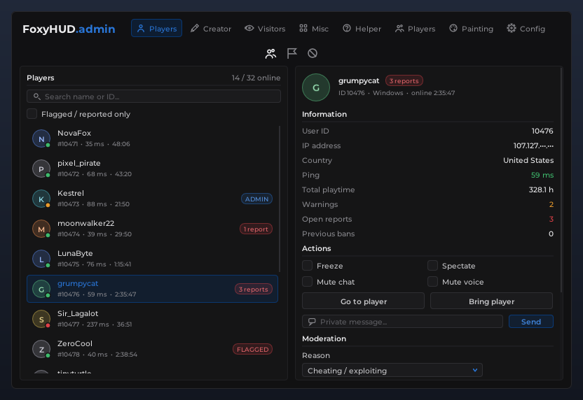
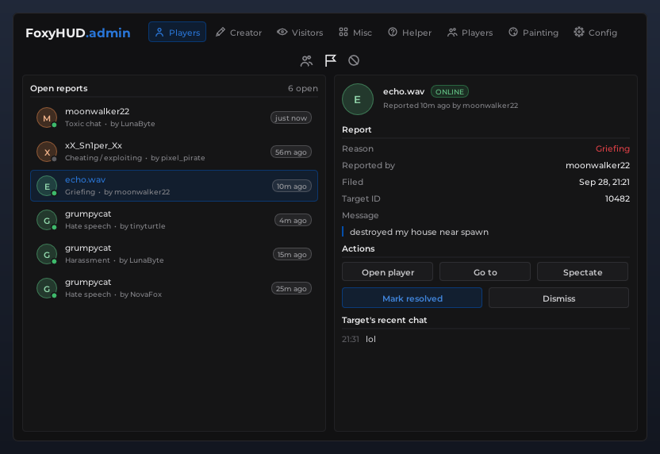
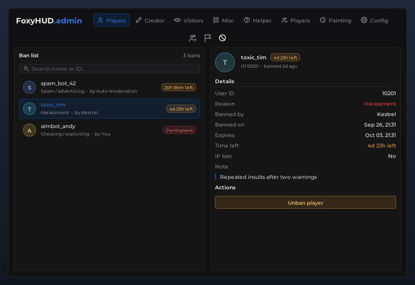
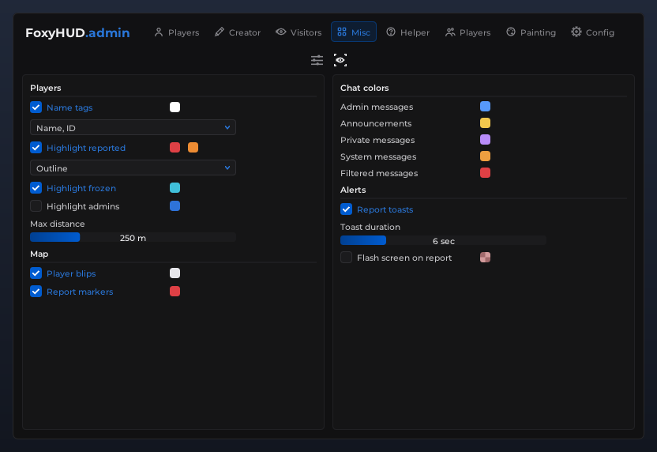
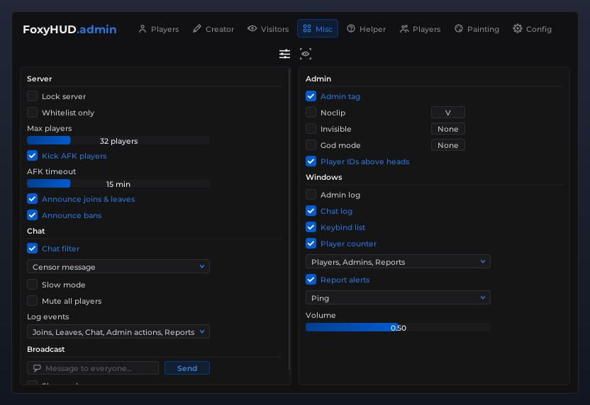
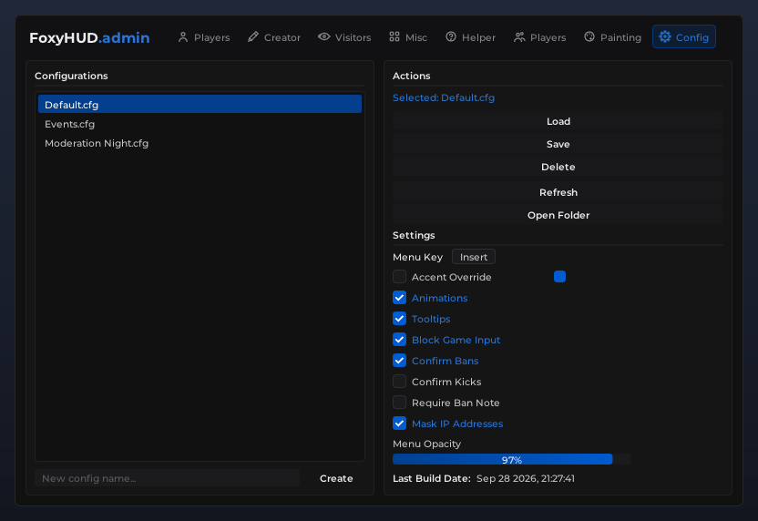
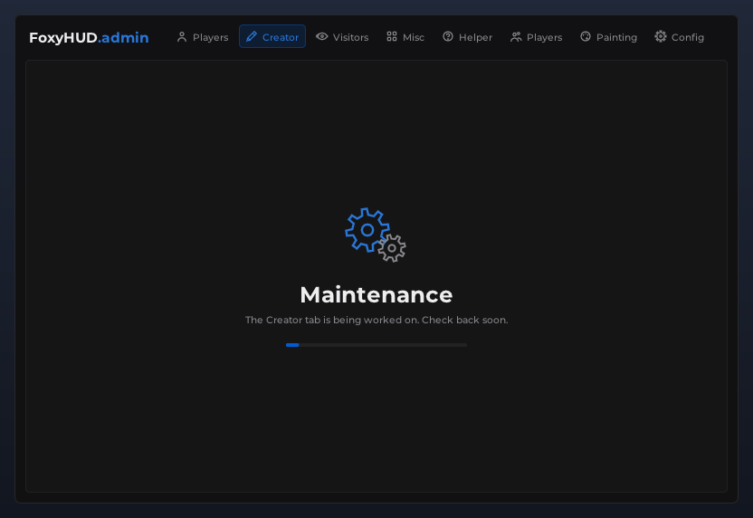
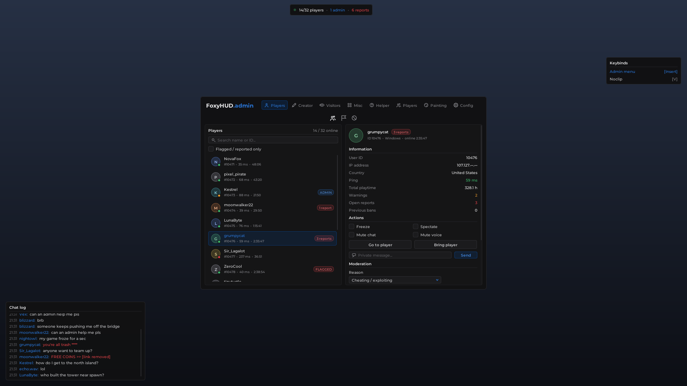

# FoxyHUD Admin Panel

An in-game admin panel overlay built on [Dear ImGui](https://github.com/ocornut/imgui).
You use it to see who is on your server and to moderate them: warn, kick, ban, freeze, mute and spectate.
The panel uses a custom dark theme: a brand name next to tabs with icons, icon sub-tabs under the header,
bordered two-column boxes, blue-filled checkboxes, color swatches, gradient sliders, blue-chevron dropdowns and
keybind boxes.



| Players: Reports | Players: Ban list | Misc: Overlays & colors |
| --- | --- | --- |
|  |  |  |

| Misc: General | Config | Maintenance placeholder |
| --- | --- | --- |
|  |  |  |

The full scene below shows the overlay windows around the panel (player counter, keybind list, chat log and
admin log):



## Tabs

`Players | Creator | Visitors | Misc | Helper | Players | Painting | Config`

Tabs with sub-pages show a row of icon buttons centered under the header; hover an icon to see its name.

| Tab | Sub-tabs | What's there |
| --- | --- | --- |
| **Players** | Online players | Player list with search and a flagged-only filter. The detail view shows ID, IP (masked), ping, playtime, warnings, reports and previous bans. From there you can freeze, mute chat/voice, spectate, teleport to or bring the player, send a private message, and warn, kick or ban. Bans take a reason, a duration, an IP-ban option and a note. The view also shows the player's recent chat. |
| | Reports | Open reports, newest first. Each one shows the reason, the reporter's message and the target's recent chat. You can open the player, go to them or spectate them, then mark the report resolved or dismiss it. |
| | Ban list | Active bans with search and time left. The detail view shows reason, admin, dates, IP ban and note, plus Unban (click twice to confirm). |
| **Misc** | General | Server settings (lock, whitelist, max players, AFK kick, announcements), chat settings (filter, slow mode, mute all, log events) and broadcast. Admin tools: admin tag, noclip, invisible and god mode, each with a keybind. It also toggles the overlay windows and report alerts. |
| | Overlays & colors | Toggles, each with a color swatch, for things your game draws for admins: name tags, highlights for reported / frozen / admin players, and map blips and markers. Also chat colors (used by the Chat log window) and report alerts, including corner pop-ups for new reports. |
| **Config** | none | The left box lists your configs; type a name at the bottom and press **Create**. Actions: Load, Save, Delete, Refresh, Open Folder. Settings: menu key, accent override (with a color swatch), animations, tooltips, block game input, confirm bans/kicks, require a ban note, mask IPs, opacity, and the build date. |
| Creator, Visitors, Helper, Players (2nd), Painting | none | These show an animated **Maintenance** placeholder until you build them. |

**Color swatches:** left-click opens the picker (color square, hue and alpha bars, preset colors and a hex field).
Right-click gives Copy / Paste, so you can move a color between swatches.

## Build the demo

You need CMake 3.16+ and a C++17 compiler. The build downloads Dear ImGui (v1.92.9b) and GLFW automatically.

```bash
cmake -S . -B build
cmake --build build --config Release
./build/foxyhud_demo            # Windows: build\Release\foxyhud_demo.exe
```

On Linux you also need the X11/GL dev packages
(`sudo apt install libgl-dev libxrandr-dev libxinerama-dev libxcursor-dev libxi-dev`).

The demo fakes a game frame in the background and runs a mock server (`src/demo/mock_backend.cpp`).
In the mock, players join and leave, chat and get reported. Press **Insert** to toggle the panel.

## Put it in your game

The panel code in `src/foxyhud/` only depends on ImGui. It doesn't care which renderer you use (DX11, DX12,
Vulkan, OpenGL or an engine's own ImGui integration).

### 1. Add it to your build

**CMake:** if your game already has an `imgui` target, the panel links against it and downloads nothing.

```cmake
add_subdirectory(foxyhud-admin-panel)
target_link_libraries(MyGame PRIVATE foxyhud_panel)
```

**Anything else:** add `src/foxyhud/*.cpp` to your project and put `src/` on the include path.
Tested with ImGui 1.91.9b and 1.92.9b; it also compiles against 1.90.9.

### 2. Initialise once, after `ImGui::CreateContext()`

```cpp
#include "foxyhud/admin_panel.h"
#include "foxyhud/theme.h"

foxy::theme::LoadFonts(dpi_scale);   // embedded Montserrat, no font files to ship
foxy::theme::Apply(dpi_scale);       // colors + style
// ...then your usual ImGui_ImplWin32_Init / ImGui_ImplDX11_Init, etc.

MyServerBackend backend;             // your IAdminBackend implementation (step 3)
foxy::AdminPanel panel(backend);     // optional 2nd arg: config folder (default "configs")
panel.SetBranding("FoxyHUD", ".admin");
```

### 3. Connect it to your server

The panel is only UI. Every button calls a method on `foxy::IAdminBackend` (`src/foxyhud/backend.h`), and you
forward those calls to your server:

```cpp
class MyServerBackend : public foxy::IAdminBackend {
public:
    const std::vector<foxy::PlayerInfo>& GetPlayers() override { return cached_players_; }
    const std::vector<foxy::ChatMessage>& GetChatLog() override { return cached_chat_; }
    const std::vector<foxy::PlayerReport>& GetReports() override { return cached_reports_; }
    const std::vector<foxy::BanEntry>& GetBans() override { return cached_bans_; }

    void Moderate(const foxy::ModerationRequest& r) override { net::Send(AdminPacket::Moderate(r)); }
    void SetFrozen(uint64_t id, bool on) override            { net::Send(AdminPacket::Freeze(id, on)); }
    void BringPlayer(uint64_t id) override                   { net::Send(AdminPacket::Bring(id)); }
    void ResolveReport(uint64_t report, bool acted) override { net::Send(AdminPacket::Resolve(report, acted)); }
    void Unban(uint64_t id) override                         { net::Send(AdminPacket::Unban(id)); }
    // ... every method has an empty default, so implement what you need.
};
```

> **Security:** the client-side panel must never be what enforces a ban. The server has to check that the
> sender is a real admin (account role or permission list) before it applies any request. Otherwise anyone who
> sends the same packets can ban people.

### 4. Draw it every frame

```cpp
ImGui_ImplDX11_NewFrame();
ImGui_ImplWin32_NewFrame();
ImGui::NewFrame();

panel.Render();                     // handles the menu key (Insert by default) and the overlay windows

ImGui::Render();
ImGui_ImplDX11_RenderDrawData(ImGui::GetDrawData());
```

While the panel is open, show the mouse cursor. Don't pass input to the game while
`panel.WantsGameInputBlocked()` is true; that's the Config tab's **Block Game Input** option. Also don't pass it
when `ImGui::GetIO().WantCaptureMouse` / `WantCaptureKeyboard` is set.
`panel.IsOpen()`, `SetOpen()` and `Toggle()` are available if you want your own open/close logic.

The Misc > Overlays settings (name tags, highlight colors, map markers) are only stored by the panel. Your game
reads them in `OnSettingsChanged(const PanelSettings&)` and draws them however it wants.

## Customising

| What | Where |
| --- | --- |
| Tab names, icons, and which tab shows which page | `kTabs` in `src/foxyhud/admin_panel.cpp` |
| Sub-tab icons and tooltips | `kPlayersSubTabs` / `kMiscSubTabs` in `src/foxyhud/admin_panel.cpp` |
| Brand text | `panel.SetBranding("Name", ".suffix")` |
| Colors | `MakeDefaultPalette()` in `src/foxyhud/theme.cpp`. The accent color can also be changed in the Config tab. |
| Font sizes | `theme::LoadFonts()` in `src/foxyhud/theme.cpp` |
| Ban reasons / durations | `src/foxyhud/panel_util.cpp` |
| Saved settings | `PanelSettings` in `src/foxyhud/settings.h`. Add a field and add one line to `VisitFields()` in `settings.cpp`. |

**Adding a real page to a Maintenance tab** (for example Creator):

1. Add a value to `Page` and a `RenderCreatorPage(const ImVec2& size)` method in `admin_panel.h`.
2. Point the tab at it in `kTabs`, then add a `case` to the `switch` in `RenderMainWindow()`.
3. If you want sub-tabs, give the tab a `SubTabDef` array in `kTabs`. The icon row then appears automatically,
   and `sub_tab_[current_tab_]` tells your page which sub-page to draw (see `RenderMiscPage`).
4. Build the page from the same widgets for the same look. `page_misc.cpp` is a short example:

```cpp
void AdminPanel::RenderCreatorPage(const ImVec2& size) {
    const float gap = ui::Px(10), half = (size.x - gap) * 0.5f;
    if (ui::BeginPanel("##creator_left", ImVec2(half, size.y))) {
        ui::Section("Build tools");
        ui::CheckboxColor("Show grid", &show_grid_, grid_color_);   // float grid_color_[4]
        ui::SliderFloat("Grid size", &grid_size_, 0.25f, 4.0f, "%.2f m");
        ui::Combo("Material", &material_, kMaterials, IM_ARRAYSIZE(kMaterials));
    }
    ui::EndPanel();
    ImGui::SameLine(0, gap);
    if (ui::BeginPanel("##creator_right", ImVec2(size.x - half - gap, size.y))) { /* ... */ }
    ui::EndPanel();
}
```

### Widget reference (`src/foxyhud/widgets.h`)

| Widget | Description |
| --- | --- |
| `BeginPanel` / `EndPanel` | Bordered box |
| `Section` | Title with a divider line under it |
| `Checkbox`, `CheckboxKeybind` | Checkbox; the second one adds a keybind in the right-hand column |
| `CheckboxColor`, `CheckboxColors`, `LabelColor`, `ColorSwatch` | Color swatches in the same column, one or several per row |
| `Keybind`, `LabelKeybind` | Keybind box (click it, then press a key; Esc clears it) |
| `IconTab` | Icon-only sub-tab button |
| `SliderFloat`, `SliderInt`, `SliderIndex` | Gradient bar with the value shown in the middle |
| `Combo`, `MultiCombo` | Dropdown; `MultiCombo` shows the selected items as a comma-separated list |
| `InputText` | Text input, optional icon |
| `Button` | Styles: `Default`, `Accent`, `Warning`, `Danger`, `Flat` (the Config action buttons), `Ghost` (text only) |
| `ConfirmButton` | Needs a second click within 3 seconds (used for Delete and Unban) |
| `SelectRow`, `ListRow` | Plain selectable row with an accent bar (config list) and an icon row |
| `KeyValue`, `Badge`, `Tooltip` | Info row, pill badge, hover tooltip |
| `BeginModal` / `EndModal` | Themed modal dialog |

## Project layout

```
src/foxyhud/          the panel (drop into your game)
  admin_panel.*         window, header tabs, hotkeys, moderation flow, confirm dialog
  page_players.cpp      Players tab (Online players, Reports, Ban list)
  page_misc.cpp         Misc tab (General, Overlays & colors)
  page_config.cpp       Config tab
  page_maintenance.cpp  placeholder for unfinished tabs
  overlay_windows.cpp   player counter, keybind list, chat log, admin log, report toasts
  widgets.*             custom-drawn widgets
  theme.*               palette, fonts, ImGui style
  icons.*               vector icons drawn with ImDrawList
  settings.*            PanelSettings + config file save/load/open folder
  backend.h             IAdminBackend: the interface your game implements
  fonts/                embedded Montserrat (Latin subset)
src/demo/             standalone GLFW + OpenGL3 demo with a mock server
```

## Licenses

- Dear ImGui: MIT
- Montserrat font: SIL Open Font License 1.1 (`third_party/licenses/Montserrat-OFL.txt`)
